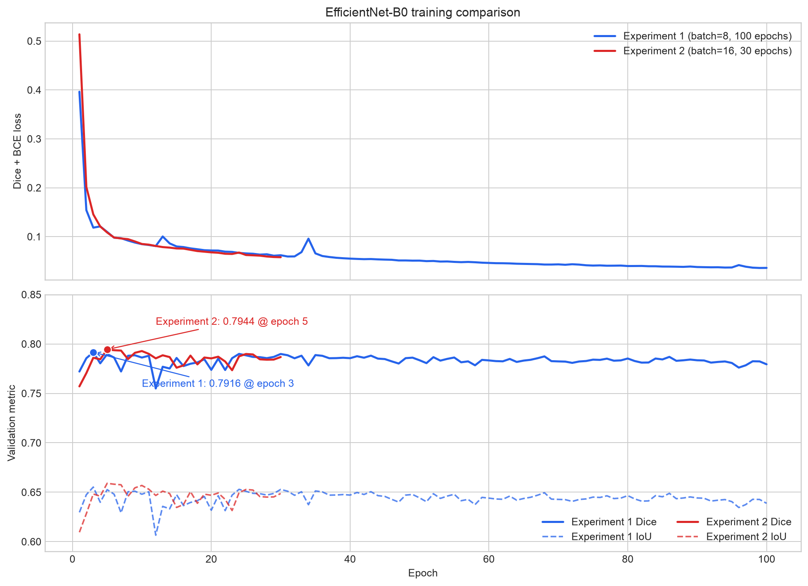
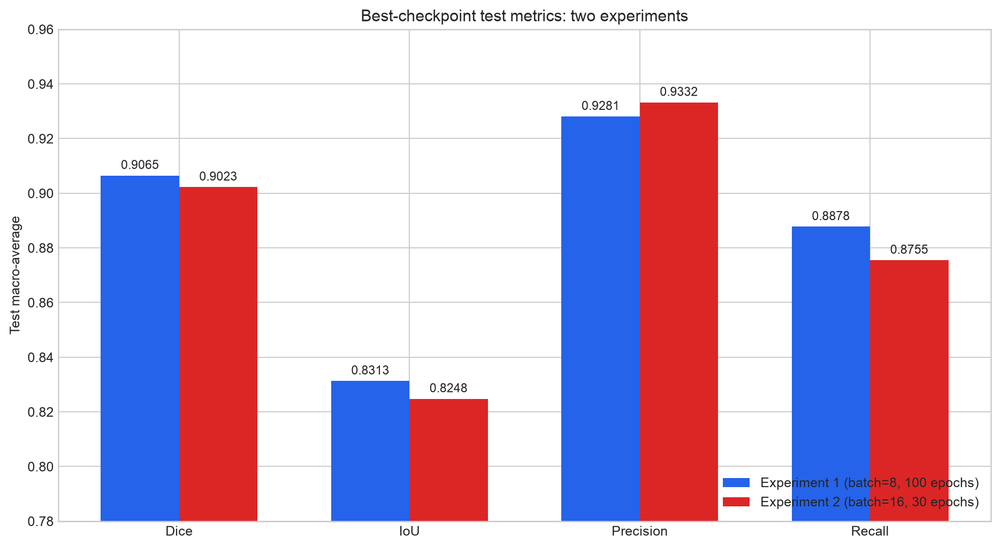

# 医学图像二值分割实验报告

## 个人负责部分：2D U-Net + EfficientNet-B0 Encoder

> 文档状态：技术内容已根据两次 GPU 训练日志和测试指标补全；封面身份信息仍需本人填写。
> 本文重点撰写本人负责的 EfficientNet-B0 模型、训练评估与批量推理部分；nnU-Net v2、MONAI SegResNet 仅引用现有实验记录，不在测试集不一致时作强行排名。

---

## 报告封面

| 项目 | 内容 |
|---|---|
| 课程名称 | 【请本人填写】 |
| 实验题目 | 基于深度学习的医学图像二值分割 |
| 小组名称/编号 | 【请本人填写】 |
| 姓名 | 【请本人填写】 |
| 学号 | 【请本人填写】 |
| 专业班级 | 【请本人填写】 |
| 指导教师 | 【请本人填写】 |
| 个人负责模型 | 2D U-Net + EfficientNet-B0 Encoder |
| 报告日期 | 2026-07-11 |

---

## 目录

1. [实验目标](#1-实验目标)
2. [算法基本原理](#2-算法基本原理)
3. [深度学习模型基本架构与模型定位](#3-深度学习模型基本架构与模型定位)
4. [EfficientNet-B0 分割网络的层结构与参数设置](#4-efficientnet-b0-分割网络的层结构与参数设置)
5. [数据处理流程](#5-数据处理流程)
6. [网络训练、验证与推理过程](#6-网络训练验证与推理过程)
7. [实验结果与对比分析](#7-实验结果与对比分析)
8. [个人完成的工作与可运行代码](#8-个人完成的工作与可运行代码)
9. [个人对深度学习的理解和练习](#9-个人对深度学习的理解和练习)
10. [实验总结](#10-实验总结)
11. [参考文献](#11-参考文献)
12. [交付前需人工补充的信息](#12-交付前需人工补充的信息)

---

# 正文

## 1. 实验目标

本实验面向三维 NIfTI 医学影像的二值分割任务。输入为一个病例的灰度体数据，输出为与原始体数据空间尺寸一致的二值掩膜，其中背景为 0、目标区域为 1。本人负责构建以 EfficientNet-B0 为编码器的轻量级 2D U-Net 分割模型，并完成从数据切片、训练验证、权重保存到批量推理的完整流程。

具体目标如下：

1. 将三维 NIfTI 体数据按病例进行训练集、验证集和测试集划分，避免同一病例的切片进入不同集合而造成数据泄漏。
2. 将三维体数据沿 z 轴转换为二维切片，建立适用于轻量级 2D 模型的数据读取与预处理流程。
3. 使用 EfficientNet-B0 提取多尺度特征，并通过 U-Net 解码器和跳跃连接恢复空间细节，完成像素级二分类。
4. 使用 Dice 与 BCE 的组合损失缓解前景与背景不平衡问题，并使用 Dice、IoU、Precision、Recall 评价模型。
5. 保存可复现的训练日志和 `.pth` checkpoint，为后续测试、模型对比与界面调用提供依据。
6. 支持对 NIfTI 体数据及常见二维图片进行批量推理，并输出二值分割结果。

## 2. 算法基本原理

### 2.1 二值语义分割

语义分割要求模型为输入图像中的每个像素预测类别。本任务只有目标与背景两类，因此模型最后输出单通道 logits：

\[
z_{ij} = f_\theta(x)_{ij},
\]

其中，\(x\) 为输入切片，\(f_\theta\) 为参数为 \(\theta\) 的分割网络，\(z_{ij}\) 为像素 \((i,j)\) 的输出。经过 Sigmoid 函数得到前景概率：

\[
p_{ij}=\sigma(z_{ij})=\frac{1}{1+e^{-z_{ij}}}.
\]

推理时采用阈值 \(t=0.5\) 得到二值预测：

\[
\hat y_{ij}=\mathbb{I}(p_{ij}\ge t).
\]

### 2.2 Dice 与 BCE 组合损失

训练采用 Binary Cross Entropy 与软 Dice 损失之和：

\[
\mathcal L = \mathcal L_{BCE} + \mathcal L_{Dice}.
\]

BCE 逐像素约束预测概率与真实标签：

\[
\mathcal L_{BCE}
=-\frac{1}{N}\sum_i\left[y_i\log p_i+(1-y_i)\log(1-p_i)\right].
\]

当前实现对每个样本计算带平滑项的软 Dice：

\[
Dice_{soft}
=\frac{2\sum_i p_i y_i+1}{\sum_i p_i+\sum_i y_i+1},
\qquad
\mathcal L_{Dice}=1-\operatorname{mean}(Dice_{soft}).
\]

BCE 提供稳定的逐像素监督，Dice 则直接关注预测区域与真实区域的重叠程度。二者组合比单独使用像素准确率更适合前景占比较小的医学分割任务。

### 2.3 评估指标

设 TP、FP、FN、TN 分别表示真正例、假正例、假负例和真负例，则本实验使用：

\[
Dice=\frac{2TP}{2TP+FP+FN},
\]

\[
IoU=\frac{TP}{TP+FP+FN},
\]

\[
Precision=\frac{TP}{TP+FP},
\qquad
Recall=\frac{TP}{TP+FN}.
\]

Dice 与 IoU 衡量区域重叠程度；Precision 反映误分情况；Recall 反映漏分情况。除精度指标外，还记录每个病例的端到端推理时间，以分析轻量级模型的效率。

## 3. 深度学习模型基本架构与模型定位

### 3.1 卷积神经网络的层次化特征

卷积神经网络通过局部连接和参数共享提取图像特征。浅层特征通常保留边缘、纹理与局部灰度变化；随着下采样加深，感受野扩大，特征逐渐表达更抽象的目标语义。分割任务既需要高层语义判断目标类别，也需要浅层空间细节确定边界，因此适合使用编码器—解码器结构。

### 3.2 U-Net 编码器—解码器结构

U-Net 包含收缩路径和扩张路径：编码器通过逐级下采样提取语义特征，解码器逐级上采样恢复分辨率。对应层之间使用跳跃连接，将编码器的高分辨率特征与解码器特征拼接，从而降低仅依赖深层特征造成的边界信息损失（见参考文献 [1]）。

### 3.3 EfficientNet-B0 编码器

EfficientNet 的核心思想是通过复合缩放同时协调网络深度、宽度和输入分辨率，而不是只扩大单一维度。其基础模块主要由 MBConv、深度可分离卷积、Squeeze-and-Excitation 通道注意力及残差连接组成。EfficientNet-B0 是该系列的基础规模模型，参数量较小，适合作为本项目的轻量级编码器（见参考文献 [2]）。

本实验不使用 EfficientNet-B0 原有的分类头，而是提取多个尺度的特征图并送入 U-Net 解码器。ImageNet 权重仅用于训练初始化；加载完整分割 checkpoint 进行评估或推理时，不重复加载预训练分类权重。

### 3.4 本模型在小组三模型中的定位

| 模型 | 输入方式 | 主要定位 | 本部分状态 |
|---|---|---|---|
| 2D U-Net + EfficientNet-B0 Encoder | 三维体数据按 z 轴切成二维切片 | 轻量、训练和推理速度较快、便于批量部署 | 本人负责，本文详细介绍 |
| nnU-Net v2 | nnU-Net 2D patches | 强基线与自配置医学分割 | 已有单病例记录，但测试集不同 |
| MONAI SegResNet | 三维 patch | 三维卷积与体上下文建模 | 尚无完成实验记录 |

该设计的主要优势是参数规模较小，可以直接复用成熟的二维预训练编码器；主要限制是每张切片独立建模，缺少显式的三维上下文，可能影响跨切片连续性和复杂边界的稳定性。

## 4. EfficientNet-B0 分割网络的层结构与参数设置

### 4.1 总体数据流


### 4.2 编码器与解码器层级

以下结构由当前项目配置实际实例化后核对。输入尺寸按默认的 \(512\times512\) 计算：

| 层级 | 空间尺寸 | 输出通道 | 主要作用 |
|---|---:|---:|---|
| 输入 | 512×512 | 1 | 单通道灰度切片 |
| Encoder level 1 | 256×256 | 32 | 初始卷积与浅层纹理特征 |
| Encoder level 2 | 128×128 | 24 | MBConv 特征提取，作为跳跃连接 |
| Encoder level 3 | 64×64 | 40 | 扩大感受野，提取中层特征 |
| Encoder level 4 | 32×32 | 112 | 高层语义特征，作为跳跃连接 |
| Encoder bottleneck | 16×16 | 320 | 最深层语义表示 |
| Decoder block 1 | 32×32 | 256 | 上采样并融合 112 通道 skip feature |
| Decoder block 2 | 64×64 | 128 | 上采样并融合 40 通道 skip feature |
| Decoder block 3 | 128×128 | 64 | 上采样并融合 24 通道 skip feature |
| Decoder block 4 | 256×256 | 32 | 上采样并融合 32 通道 skip feature |
| Decoder block 5 | 512×512 | 16 | 恢复到输入分辨率 |
| Segmentation head | 512×512 | 1 | 3×3 卷积输出二分类 logits |

解码器默认通道序列为 `(256, 128, 64, 32, 16)`。跳跃连接使用通道拼接，将编码器的定位信息与解码器的高层语义特征融合。该通道序列来自当前 `segmentation-models-pytorch` U-Net 默认实现，而不是本项目自行设计的自定义 decoder（见参考文献 [3]）。

### 4.3 参数量

| 模块 | 可训练参数量 |
|---|---:|
| EfficientNet-B0 encoder | 4,006,972 |
| U-Net decoder | 2,243,776 |
| Segmentation head | 145 |
| **总计** | **6,250,893** |

当前模型全部参数均参与训练，总可训练参数量约为 6.25 M。该数值来自当前依赖版本和项目配置的实际模型实例，不使用分类头。

### 4.4 主要超参数

| 类别 | 参数 | 两次实验实际值 | 说明 |
|---|---|---:|---|
| 数据 | 输入尺寸 | 512×512 | 图像双线性缩放，mask 最近邻缩放 |
| 数据 | 切片轴 | z | 将三维体数据转换为二维样本 |
| 数据 | 前景切片保留比例 | 1.0 | 保留全部含前景切片 |
| 数据 | 空切片保留比例 | 0.25 | 仅作用于训练集，降低背景主导程度 |
| 模型 | encoder | efficientnet-b0 | EfficientNet-B0 多尺度特征编码 |
| 模型 | encoder 初始化 | ImageNet | 两次日志均确认初始化成功 |
| 模型 | 输入/输出通道 | 1 / 1 | 灰度输入、二值输出 |
| 训练 | 随机种子 | 42 | 控制数据划分与训练随机性 |
| 训练 | epoch | 实验 1：100；实验 2：30 | 均按实际日志中的完整轮数统计 |
| 训练 | batch size | 实验 1：8；实验 2：16 | 第二次实验考察更大 batch size |
| 训练 | 优化器 | AdamW | 当前仅支持 AdamW |
| 训练 | 学习率 | 0.0003 | 初始学习率 |
| 训练 | weight decay | 0.01 | 权重衰减 |
| 训练 | 损失函数 | Dice + BCE | 区域重叠与逐像素监督结合 |
| 训练 | 设备 / AMP | CUDA / 已启用 | 两次实验均在 NVIDIA GPU 上运行 |
| 推理 | 阈值 | 0.5 | Sigmoid 概率二值化阈值 |
| 推理 | slice batch size | 8 | 一个 forward 处理的切片数 |

除 epoch 与训练 batch size 外，两次实验的模型、数据、优化器和推理配置保持一致。实验 2 的日志启动元数据已按实际完成轮数更正为 30，且共有 30 条连续的 `epoch_completed` 记录。

## 5. 数据处理流程

### 5.1 病例级划分

项目默认使用随机种子 42，按病例进行 70%/15%/15% 的训练、验证和测试划分。同一病例的全部切片始终位于同一集合，从源头避免相邻切片泄漏导致的虚高指标。

两次实验的 `run_started` 记录均为训练 9 例、验证 2 例，且训练/验证切片数完全一致；测试指标文件也包含相同的 2 个病例。因此两次实验之间的数据输入具有可比性。实验快照可确认的数据规模如下：

| 集合 | 病例数 | 模型实际读取的二维切片数 | 统计口径 |
|---|---:|---:|---|
| 训练集 | 9 | 2,270 | 保留全部前景切片，并确定性抽取 25% 空切片后的数量 |
| 验证集 | 2 | 557 | 保留全部切片；完整病例名未写入训练日志 |
| 测试集 | 2 | 629 | `2_25_XY` 298 层、`S-4` 331 层，均保留全部切片 |

需要注意，实验记录中的测试病例为 `2_25_XY` 与 `S-4`，而后续 `docs/DATASET_AUDIT.md` 记录的规范化 13 例数据划分中测试病例为 `2_25_XY` 与 `S_3`。这说明本报告指标对应的是两次运行所使用的实验数据快照，不能直接当作后续规范化数据版本的测试结果。若小组最终统一到新数据版本，应重新训练或至少用相应 checkpoint 在统一测试集上重新评估。

### 5.2 掩膜二值化与切片采样

原始 mask 统一执行 `mask > 0` 转为 0/1。训练集保留全部含前景切片，并按 0.25 的比例确定性保留空切片；验证集和测试集保留全部切片，以保证评价覆盖完整病例。采样随机数由种子和病例编号共同确定，因此重复运行可复现。

### 5.3 强度归一化与尺寸变换

每张灰度切片使用第 1 和第 99 百分位进行强度截断与归一化：

\[
x'=\operatorname{clip}\left(\frac{x-P_1(x)}{P_{99}(x)-P_1(x)},0,1\right).
\]

当上下百分位相等时返回全零切片，避免除零。图像使用双线性插值缩放到 512×512，mask 使用最近邻插值，以避免插值产生非整数类别值；缩放后再次执行二值化。

## 6. 网络训练、验证与推理过程

### 6.1 训练过程

训练流程如下：

1. 加载 YAML 配置并校验模型 key、优化器、损失函数、epoch、batch size 和 worker 数。
2. 固定 Python、NumPy 和 PyTorch 随机种子；CUDA 可用时同步固定 CUDA 随机种子。
3. 按病例生成训练集与验证集，并建立 DataLoader。训练集开启 shuffle，验证集关闭 shuffle。
4. 使用 ImageNet 权重初始化 EfficientNet-B0 encoder；若预训练权重不可用，记录警告并回退到随机初始化。
5. 每个 batch 执行前向传播、Dice+BCE 损失计算、反向传播和 AdamW 参数更新。CUDA 环境可使用自动混合精度和 GradScaler（见参考文献 [4]、[5]）。
6. 每个 epoch 结束后，在完整验证病例上计算 Dice、IoU、Precision 和 Recall。
7. 若验证 Dice 高于历史最佳值，则原子保存新的 `best.pth`。

### 6.2 日志与 checkpoint

每次训练使用微秒精度 UTC 时间戳作为 `run_name`：

- 日志：`outputs/efficientnet_b0/<run_name>/train.log`
- 权重：`checkpoints/efficientnet_b0/<run_name>/best.pth`

日志为 JSONL 格式，主要事件包括 `run_started`、`epoch_completed`、`checkpoint_saved` 和 `run_completed`。首条日志保存模型、数据、优化器、学习率、batch size、epoch、AMP、设备、worker、验证阈值等主要超参数。checkpoint 保存模型状态、配置、最佳 epoch、最佳验证 Dice、初始化方式和 `run_name`，便于追溯实验。

本报告使用的两组产物如下：

| 实验 | `run_name` | 训练日志 | 最佳 checkpoint | 测试指标 |
|---|---|---|---|---|
| 实验 1 | `20260710T152124825334Z` | `outputs/efficientnet_b0/20260710T152124825334Z/train.log` | `checkpoints/efficientnet_b0/20260710T152124825334Z/best.pth` | `outputs/efficientnet_b0/20260710T152124825334Z/metrics.json` |
| 实验 2 | `20260711T031117144692Z` | `outputs/efficientnet_b0/20260711T031117144692Z/train.log` | `checkpoints/efficientnet_b0/20260711T031117144692Z/best.pth` | `outputs/efficientnet_b0/20260711T031117144692Z/metrics.json` |

### 6.3 验证方法

验证时先对同一病例的全部切片累计 TP、FP、FN、TN，再计算该病例的 Dice、IoU、Precision 和 Recall，最后对病例做宏平均。采用这种方式可以避免将每张切片错误地当作独立病例，也避免病例切片数不同对总体结果产生不合理的权重偏置。

### 6.4 推理过程

整卷 NIfTI 推理步骤如下：

1. 读取三维体数据，并检查输入是否为 3D。
2. 沿配置的 z 轴提取切片，按 `inference.batch_size` 分批前向传播。
3. 对每批 logits 使用 Sigmoid 和 0.5 阈值得到二值 mask。
4. 将每张 mask 用最近邻插值恢复到原始切片尺寸。
5. 按原顺序重建三维二值 mask。
6. 使用参考 NIfTI 保存结果，保留原影像的 affine 和 header。

统一批量推理接口同时支持 `.nii`、`.nii.gz` 和常见二维图片。NIfTI 输出命名为 `<case>_Seg.nii.gz`；二维图片输出同名二值 PNG。推理结果还记录病例编号、输出路径、体数据形状和端到端耗时。

## 7. 实验结果与对比分析

### 7.1 两次实验概况

两次实验均使用相同的数据快照、模型结构、ImageNet encoder 初始化、损失函数、优化器、学习率和评估阈值，主要差异是训练 batch size 和训练轮数。

| 实验 | `run_name` | batch size | 实际 epoch | 最佳验证 epoch | 最佳验证 Dice | 最后一轮 train loss |
|---|---|---:|---:|---:|---:|---:|
| 实验 1 | `20260710T152124825334Z` | 8 | 100 | 3 | 0.7916 | 0.0360 |
| 实验 2 | `20260711T031117144692Z` | 16 | 30 | 5 | 0.7944 | 0.0579 |

实验 2 按实际完成的 30 轮统计，其日志包含连续的 epoch 1—30 记录。两次实验均使用各自验证 Dice 最高时保存的 `best.pth` 在同一测试集上评估，以下测试指标均为病例宏平均。

### 7.2 训练曲线与验证结果



| 指标 | 实验 1（batch 8，100 轮） | 实验 2（batch 16，30 轮） |
|---|---:|---:|
| 第 1 轮 train loss | 0.3963 | 0.5137 |
| 最后一轮 train loss | 0.0360 | 0.0579 |
| 最佳验证 epoch | 3 | 5 |
| 最佳验证 Dice | 0.7916 | 0.7944 |
| 对应验证 IoU | 0.6552 | 0.6590 |
| 对应验证 Precision | 0.8581 | 0.8649 |
| 对应验证 Recall | 0.7370 | 0.7357 |
| 最后一轮验证 Dice | 0.7794 | 0.7868 |

实验 1 的训练损失在 100 轮内由 0.3963 下降到 0.0360，但验证 Dice 在第 3 轮达到 0.7916 后长期围绕约 0.78 波动；实验 2 在第 5 轮达到更高但接近的 0.7944，后续到第 30 轮也没有刷新。两次运行都表现出“训练损失继续改善而验证指标很早进入平台”的现象，说明当前小样本配置存在早期饱和和过拟合风险，使用 early stopping 比固定长训练更合理。

### 7.3 测试集结果

| 指标 | 实验 1 最佳验证 | 实验 1 测试 | 实验 2 最佳验证 | 实验 2 测试 |
|---|---:|---:|---:|---:|
| Dice | 0.7916 | **0.9065** | **0.7944** | 0.9023 |
| IoU | 0.6552 | **0.8313** | **0.6590** | 0.8248 |
| Precision | 0.8581 | 0.9281 | **0.8649** | **0.9332** |
| Recall | **0.7370** | **0.8878** | 0.7357 | 0.8755 |
| 端到端推理时间/病例 | 未记录 | **9.96 s** | 未记录 | 10.21 s |
| 峰值显存 | 未记录 | 未记录 | 未记录 | 未记录 |

逐病例结果如下：

| 实验 | 病例 | 体数据尺寸 | Dice | IoU | Precision | Recall | 推理时间/s |
|---|---|---:|---:|---:|---:|---:|---:|
| 实验 1 | `2_25_XY` | 973×973×298 | 0.8674 | 0.7658 | 0.9195 | 0.8208 | 14.18 |
| 实验 1 | `S-4` | 512×512×331 | 0.9456 | 0.8968 | 0.9367 | 0.9547 | 5.73 |
| 实验 2 | `2_25_XY` | 973×973×298 | 0.8587 | 0.7524 | 0.9230 | 0.8028 | 14.33 |
| 实验 2 | `S-4` | 512×512×331 | 0.9458 | 0.8972 | 0.9434 | 0.9482 | 6.08 |



这里使用各时间戳目录中 `metrics.json` 的原始耗时。`docs/EXPERIMENTS.md` 中实验 1 的早期汇总记录为 11.16 s/病例，而与本次时间戳产物绑定的重复评估为 9.96 s/病例；两份记录的 Dice、IoU、Precision 和 Recall 完全一致。由于端到端耗时会受到磁盘读写和运行时负载影响，本报告采用可追溯到当前 `run_name` 的 9.96 s，同时将耗时视为近似量而非稳定硬件基准。

### 7.4 两次实验对比分析

1. **验证表现接近。** 实验 2 的最佳验证 Dice 比实验 1 高 0.0028，最佳验证 IoU 高 0.0038，但差值很小，不能据此断言 batch size 16 更优。
2. **测试精度没有随最佳验证值同步提高。** 实验 1 的测试 Dice 和 IoU 分别比实验 2 高 0.0042 和 0.0065；实验 2 的 Precision 高 0.0051，但 Recall 低 0.0123，表现为更保守的前景预测倾向。
3. **30 轮已达到与 100 轮相近的结果。** 两次实验的最佳 checkpoint 都出现在前 5 轮，实验 1 后续 95 轮没有刷新最佳验证 Dice。对当前数据快照而言，继续训练到 100 轮没有显示出测试收益。
4. **病例差异明显。** 两次实验中 `S-4` 的 Dice 均约为 0.946，而 `2_25_XY` 约为 0.86，说明宏平均容易受仅有的两个病例及其难度构成影响。
5. **不是严格单变量消融。** 两次实验同时改变了 batch size 和 epoch 数，因此只能说明两套训练设置得到相近结果，不能把差异单独归因于 batch size。后续若要研究 batch size，应固定随机性、训练轮数或总优化步数并重复多次实验。

### 7.5 与小组其他模型记录的关系

合并 `main` 后，`docs/EXPERIMENTS.md` 中已有一轮使用规范化 9/2/2 病例划分的 nnU-Net v2 2D 200 轮实验；MONAI SegResNet 尚无完成指标。现有 EfficientNet-B0 与 nnU-Net 记录的测试对象和推理硬件口径仍不相同，只能作背景信息，不能作公平排名：

| 模型/记录 | 测试对象 | 参数量 | Dice | IoU | Precision | Recall | 推理时间/病例 |
|---|---|---:|---:|---:|---:|---:|---:|
| 2D U-Net + EfficientNet-B0（实验 1） | `2_25_XY`、`S-4`，2 例宏平均 | 6.25 M | 0.9065 | 0.8313 | 0.9281 | 0.8878 | 9.96 s |
| nnU-Net v2 2D 200 epochs（最新记录） | `2_25_XY`、`S_3`，2 例宏平均 | 未记录 | 0.9490 | 0.9048 | 0.9581 | 0.9405 | 427.0 s（GPU/CPU 混合） |
| MONAI SegResNet | 无完成记录 | 未记录 | 未记录 | 未记录 | 未记录 | 未记录 | 未记录 |

nnU-Net 的数值更高，但两组测试集的第二个病例分别是 `S-4` 与 `S_3`；此外 nnU-Net 的大体积病例因 CUDA 显存不足使用 CPU fallback，其耗时与 EfficientNet-B0 的全 GPU 结果不是同一硬件口径。因此不能据此得出模型优劣结论。最终三模型横向对比必须让三者使用同一冻结测试集、相同二值化规则、相同病例宏平均口径和一致硬件，并补充峰值显存后再进行。

### 7.6 可视化证据与限制

本报告已给出训练曲线和两次测试宏平均指标图。当前转移到本工作区的 EfficientNet-B0 产物包含预测 NIfTI 和指标文件，但本地数据目录没有与该旧实验快照完全匹配的 `2_25_XY`、`S-4` 原图及真实 mask 组合，因此未生成可能错配病例的预测叠加图。若课程要求定性展示，应从原训练电脑导出同一数据快照的原图、真实 mask 和预测 mask，再补充一个高 Dice 病例、一个低 Dice 病例及典型误差区域；在数据未核对前不应使用其他同名或规范化版本替代。

## 8. 个人完成的工作与可运行代码

### 8.1 个人完成的工作

本人在本项目中主要完成了以下工作：

1. 配置并实现 2D U-Net + EfficientNet-B0 encoder 分割模型。
2. 实现三维 NIfTI 按 z 轴生成二维训练样本的流程，包括 mask 二值化、空切片采样、百分位归一化和尺寸变换。
3. 实现 Dice+BCE 训练循环、病例级验证指标、AMP、最佳 checkpoint 保存及训练日志。
4. 将每次训练按 UTC 时间戳隔离，使用 `.pth` 保存权重，并在 JSONL 日志中记录主要超参数和逐轮指标。
5. 实现整卷切片批推理、三维 mask 重建、affine/header 保留及二维图片推理。
6. 将 EfficientNet-B0 接入公共批量推理接口，并补充相关自动化测试和运行文档。
7. 完成 batch size 8/100 轮与 batch size 16/30 轮两组 GPU 实验，整理训练曲线、逐病例结果和误差分析。

### 8.2 主要代码文件

| 文件 | 作用 |
|---|---|
| `configs/efficientnet_b0/base.yaml` | EfficientNet-B0 模型、训练、推理及产物路径配置 |
| `src/img_seg/models/efficientnet_b0.py` | 模型构建、checkpoint 加载、NIfTI/图片预测 |
| `src/img_seg/training/efficientnet_b0_cli.py` | 训练、验证、日志、checkpoint 与评估 CLI |
| `src/img_seg/data/slices.py` | 二维切片样本、归一化、缩放和 NIfTI 缓存 |
| `src/img_seg/inference/batch.py` | 公共批量推理接口与结果组织 |
| `src/img_seg/inference/cli.py` | 命令行批量推理入口 |
| `src/img_seg/evaluation/metrics.py` | Dice、IoU、Precision、Recall 计算 |
| `tests/test_efficientnet_b0.py` | 模型、数据、训练日志和 checkpoint 测试 |
| `tests/test_inference_batch.py` | 批量推理与 checkpoint 枚举测试 |

### 8.3 环境与运行命令

安装依赖：

```powershell
uv sync
```

运行相关测试：

```powershell
uv run pytest tests/test_efficientnet_b0.py tests/test_inference_batch.py -q
uv run ruff check .
```

开始训练：

```powershell
uv run imgseg-efficientnet train --config configs/efficientnet_b0/base.yaml
```

两次已完成实验可使用以下命令复核测试指标：

```powershell
$RUN_NAMES = @(
  "20260710T152124825334Z",
  "20260711T031117144692Z"
)

foreach ($RUN_NAME in $RUN_NAMES) {
  uv run imgseg-efficientnet evaluate `
    --config configs/efficientnet_b0/base.yaml `
    --checkpoint "checkpoints/efficientnet_b0/$RUN_NAME/best.pth" `
    --split test `
    --output-dir "outputs/efficientnet_b0/$RUN_NAME" `
    --output-json "outputs/efficientnet_b0/$RUN_NAME/metrics.json"
}
```

以实验 1 的最佳 checkpoint 批量推理：

```powershell
$RUN_NAME = "20260710T152124825334Z"
uv run imgseg-predict `
  --model efficientnet_b0 `
  --config configs/efficientnet_b0/base.yaml `
  --checkpoint "checkpoints/efficientnet_b0/$RUN_NAME/best.pth" `
  --input-dir Test `
  --output-dir "Test_Seg/$RUN_NAME"
```

## 9. 个人对深度学习的理解和练习

通过本次实验，我对深度学习的理解从“调用一个网络完成预测”进一步转向了“建立可验证、可复现的完整实验系统”。模型结构只是结果的一部分，数据划分、预处理、损失函数、评价口径、日志和推理流程同样会直接影响结论是否可信。

第一，医学图像分割与普通图像分类不同。分类只需要给出整张图像的类别，而分割必须对每个像素作出判断。目标区域通常远小于背景，因此简单追求像素准确率可能得到“全部预测为背景”的无效模型。Dice、IoU 及 Dice 类损失能够更直接地反映目标区域的重叠质量。

第二，数据泄漏会使模型指标失去意义。三维体数据的相邻切片非常相似，如果先切片再随机分配，来自同一病例的切片可能同时出现在训练集和测试集，造成过于乐观的结果。因此本实验坚持先按病例划分，再在集合内部生成切片。

第三，模型设计本质上是精度、速度和资源之间的权衡。EfficientNet-B0 + U-Net 利用轻量级编码器和二维切片降低了显存与计算开销，但代价是缺少直接的三维上下文。是否值得采用该模型，不能只看 Dice，还应结合推理时间、显存、参数量和跨切片连续性进行判断。

第四，训练过程必须可追溯。将每次运行用时间戳隔离，并记录超参数、逐轮指标和最佳 checkpoint，可以避免不同实验相互覆盖，也能保证最终报告中的指标能够对应到具体配置和权重。

本次完成的主要练习包括：读取和保存 NIfTI、保持 affine/header、构造二维切片数据集、实现二值化和百分位归一化、搭建预训练编码器 U-Net、实现 Dice+BCE 损失、使用 AMP、按病例汇总指标、批量重建三维 mask，以及为训练和推理逻辑编写自动化测试。这些练习使我认识到，深度学习实验不仅需要理解网络原理，还需要具备数据工程、软件工程和实验设计能力。

## 10. 实验总结

本人完成了基于 EfficientNet-B0 编码器的 2D U-Net 医学图像二值分割流程。当前模型输入单通道 512×512 切片，总参数量约 6.25 M，采用 Dice+BCE 损失、AdamW 优化器和病例级验证。工程实现已经覆盖数据切片、训练日志、最佳 `.pth` checkpoint、整卷批量推理、空间信息保留及自动化测试。

本报告分析了两次正式 GPU 实验。实验 1 使用 batch size 8 训练 100 轮，最佳验证 Dice 为 0.7916，测试宏平均 Dice 为 0.9065；实验 2 使用 batch size 16 训练 30 轮，最佳验证 Dice 为 0.7944，测试宏平均 Dice 为 0.9023。两次测试 Dice 仅相差 0.0042，且最佳 checkpoint 都出现在前 5 轮，表明在当前数据快照上，延长到 100 轮没有带来明确收益，采用 early stopping 更合适。

同时，结论具有明确边界：测试集只有 2 个病例，两病例 Dice 差异较大；两次实验同时改变 batch size 与训练轮数，不能解释为严格的单变量消融；实验快照与后续规范化数据审计中的测试病例不完全一致；峰值显存和匹配的定性叠加图尚未记录。因此，0.9065 应视为固定旧数据快照上的项目基线，而不是稳定的跨数据泛化结论。三模型最终比较仍需在同一冻结测试集和同一评估口径下重新完成。

## 11. 参考文献

[1] O. Ronneberger, P. Fischer, and T. Brox. *U-Net: Convolutional Networks for Biomedical Image Segmentation*. MICCAI, 2015. <https://arxiv.org/abs/1505.04597>

[2] M. Tan and Q. V. Le. *EfficientNet: Rethinking Model Scaling for Convolutional Neural Networks*. ICML, 2019. <https://arxiv.org/abs/1905.11946>

[3] Segmentation Models PyTorch. *U-Net model documentation*. <https://smp.readthedocs.io/en/stable/models.html>

[4] PyTorch Documentation. *Automatic Mixed Precision Examples*. <https://docs.pytorch.org/docs/stable/notes/amp_examples.html>

[5] PyTorch Documentation. *AdamW*. <https://docs.pytorch.org/docs/stable/generated/torch.optim.adamw.AdamW_class.html>

## 12. 交付前需人工补充的信息

技术结果部分已经根据现有可追溯产物完成：

- [x] 两次 `run_name`、日志、checkpoint 和指标路径。
- [x] 实际 epoch、batch size、设备、AMP 和 encoder 初始化状态。
- [x] 训练/验证/测试病例数及日志可确认的切片数。
- [x] Train loss、Validation Dice/IoU 曲线和最佳 epoch。
- [x] 两次实验的验证/测试 Dice、IoU、Precision、Recall。
- [x] 每个测试病例的体数据尺寸、指标和推理时间。
- [x] 两次实验的差异、过拟合风险和小样本限制分析。

以下信息无法从代码或实验日志可靠推断，应在提交课程作业前由本人或小组补充：

- [ ] 封面中的课程、小组、姓名、学号、专业班级和指导教师。
- [ ] 两个最佳 checkpoint 的外部存储链接或课程要求的附件位置。
- [ ] 若评分要求硬件资源对比，补测并填写峰值显存。
- [ ] 从原训练电脑导出与旧实验快照严格匹配的原图、真实 mask 和预测 mask，补充定性叠加图。
- [ ] 若并入小组总报告，在同一冻结测试集上补齐 nnU-Net v2、MONAI SegResNet 的可比指标后再写三模型排名。
